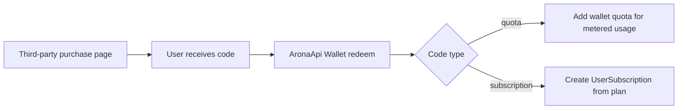

# Design: Separate subscription redemption from balance billing

## Product decision captured

Subscriptions and wallet balance are separate economic ledgers:

- wallet/quota balance is only for metered pay-as-you-go API usage;
- subscription entitlement is only granted by subscription redemption codes or administrator assignment;
- no user-facing path may convert wallet balance into subscription entitlement;
- built-in subscription payment gateways are out of scope for this phase.

## Current AronaApi flow

### Already aligned

- `E:\A_programming\AronaApi\model\redemption.go` supports `quota` and `subscription` code types.
- `E:\A_programming\AronaApi\model\redemption.go:184` dispatches subscription codes separately from quota codes.
- `E:\A_programming\AronaApi\model\redemption.go:192` grants subscription via `CreateUserSubscriptionFromPlanTx(..., "redemption")` without deducting wallet quota.
- `E:\A_programming\AronaApi\web\default\src\features\wallet\purchase-page.tsx` already has an embedded purchase page pattern for buying a code externally and redeeming inside Wallet.

### Conflicting paths

- Backend route `E:\A_programming\AronaApi\router\api-router.go:158` exposes `POST /api/subscription/balance/pay`.
- Handler `E:\A_programming\AronaApi\controller\subscription.go:100` calls `model.PurchaseSubscriptionWithBalance`.
- Model function `E:\A_programming\AronaApi\model\subscription.go:727` deducts user quota/balance and creates a subscription.
- Plan config defaults `allow_balance_pay` to true in `E:\A_programming\AronaApi\model\subscription.go:205` and `E:\A_programming\AronaApi\controller\subscription.go:168`.
- Frontend purchase dialog imports/calls `paySubscriptionBalance` and renders “Pay with Balance” in `E:\A_programming\AronaApi\web\default\src\features\subscriptions\components\dialogs\subscription-purchase-dialog.tsx:46`, `:239`, `:362`.
- Direct gateway subscription endpoints also exist: Stripe, Creem, Epay, Waffo Pancake under `E:\A_programming\AronaApi\router\api-router.go:159-162`. They are not wanted for this phase.

## Target architecture

### Subscription acquisition

### Backend contract

1. Keep subscription plans as entitlement templates.
2. Keep admin-created subscription redemption codes.
3. Keep admin direct assignment for support/manual operations.
4. Disable user-facing subscription purchase endpoints that create subscriptions from wallet or built-in payment gateways.
5. Keep wallet/quota top-up and quota redemption separate from subscription entitlement.
6. Keep `allow_wallet_overflow`: if a subscription permits overflow, metered usage can fall back to wallet after subscription quota is exhausted. This still uses balance only for pay-as-you-go usage.

### Frontend contract

1. Subscription cards may still display plan terms and current subscriptions.
2. The user action should point to “Purchase Redemption Code” / embedded purchase page, then “Redeem in Wallet”.
3. Remove/hide “Pay with Balance” for subscriptions.
4. Do not surface Stripe/Creem/Epay/Waffo Pancake subscription purchase buttons in this phase.
5. Admin subscription plan form should not encourage balance redemption. The old `allow_balance_pay` field can remain in API/DB for compatibility, but should not be presented as an active product control.

## Compatibility / migration

- No destructive database migration required.
- Existing `allow_balance_pay = true` rows become inert because backend rejects balance purchase regardless of row value.
- Existing subscription orders and user subscriptions remain historical records.
- Existing active subscriptions continue to work for billing.
- Existing quota redemption and quota balance behavior is unchanged.

## Backend implementation approach

- Introduce a clear sentinel error, e.g. `ErrSubscriptionBalancePurchaseDisabled`.
- Make `model.PurchaseSubscriptionWithBalance` return that error before it can deduct quota.
- Make `controller.SubscriptionRequestBalancePay` return a clear API error using the same path, or directly reject before model call.
- Disable or hard-reject user-facing subscription gateway pay handlers for this phase if product scope confirms “no gateway subscription purchase”.
- Keep admin direct bind and code redemption intact.
- Add model/controller tests proving wallet quota is not deducted and no subscription is created via `/api/subscription/balance/pay`.

## Frontend implementation approach

- Remove `paySubscriptionBalance` from the subscription purchase dialog.
- Replace purchase choices with a redemption-code-first CTA to `/wallet/purchase` and `/wallet`.
- Remove `allow_balance_pay` switch from admin plan drawer or mark it internal/legacy if type compatibility requires keeping form payload fields.
- Keep subscription redemption-code UI in `web/default/src/features/redemption-codes`.

## Rollback

- Revert the handler/model guard and restore UI buttons. Because no schema migration is required, rollback is low-risk.
